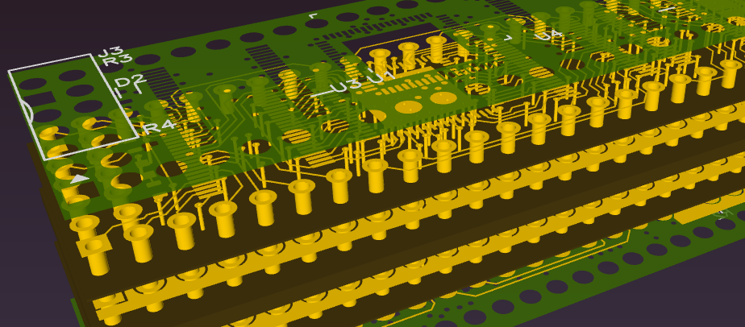

= Deniser - Amiga Denise chip replacement

== Introduction

*Deniser* is a *drop-in replacement for the Amiga computer Denise chip*.

This repository contains board design files, FPGA logic source
code and synthesis scripts.
The idea is to make the material available for anyone to build
and program the board for use as a Denise chip replacement.

=== Background

*Denise* is the Amiga custom chip responsible for most of the
graphic related tasks such as bitplane display, palette
registers, smooth scrolling, hardware sprites, flexible screen
object priority, collision detection and more.
In the Amiga, Denise operates in concert with the
*Agnus* (DMA, blitter, copper) and *Paula* (I/O, interrupt controller).
The chipset was released in 1985.

== Board

.Main board components
[cols="1,3,1,3"]
|===
| Item    | Description                    | Item | Description

| 1       | JTAG header                    | 4    | MachXO3D FPGA
| 2       | User LED                       | 7, 9 | 48-pin DIP connector
| 3, 5, 6 | Bus transceiver 5 V <--> 3.3 V | 8    | Voltage regulator
|===

The Deniser board has 48-pin DIP form factor ready to be mounted
in an IC socket.
Schematic, BOM and more information can be found in the dedicated
link:doc/board.pdf[Deniser board document].

=== Installation

Installation is as easy as removing the original Denise IC from its
socket and put the Deniser board in its place.

The jumper wires in the picture are not required for normal
operation and can be disconnected after the FPGA on-chip
configuration flash has been programmed.

=== EDA tool

Schematic and board layout is designed using
https://horizon-eda.org[Horizon EDA].
Project files are located in the link:pcb[] directory from which
Gerber files and bill of materials (BOM) can be generated.

[cols="^.^a,^.^a"]
|===
| image::picture/horizon-eda-schematic.png[Horizon EDA schematic editor, 483]
| image::picture/horizon-eda-board.png[Horizon EDA board editor, 483]

|===

=== Manufacturing

The PCB layout has been tailored for the JLCPCB four-layer
process named JLC2313.
The Deniser board can be assembled by hand.
Reflow soldering is required for the QFN FPGA and the smallest
BOM items are 0402 SMD capacitors.

== Logic design

The digital logic is written in VHDL.
Source code can be found in the link:hdl[] directory.

Lattice MachXO3D is the target FPGA device.
The vendor tool Lattice Diamond 3.12 comes with the
third party tool Synplify for synthesis and ModelSim for
simulation.

=== FPGA implementation

To run the synthesis and place and route flow with Lattice Diamond:

  cd dia
  make export

The above command generates an FPGA bitstream.
Configure the FPGA volatile RAM with `make conf`, or
program the FPGA non-volatile flash with `make prog`.
Information on how to connect the JTAG interface is available in the
link:doc/board.pdf[Deniser board documentation].
 
`make slaunch` starts an interactive Synplify synthesis session.
`make launch` brings up Lattice Diamond interactively for working with
the constraints, floor plan, etc.

=== Simulation

A bus functional model and example test cases are available
to exercise and explore the Deniser logic.
See the directories link:ghdl[] link:vsim[] and link:vsim-hw[]
for running RTL simulation and gate level simulation.

== License

The Deniser board is licensed under the _GNU General Public
License version 2 or any later version_.
This applies to the design files (schematic and board layout)
in the link:pcb[] directory.

The logic design is licensed under the _GNU General Public
License version 2 or any later version_.  This applies to the
VHDL files in the link:hdl[] directory.

== Status

* Known to work:
  - Schematic, PCB layout and BOM
  - Use in Amiga A500 with ECS Agnus (PAL)
  - Workbench, Deluxe Paint, demos
  - Extra Half Brite (EHB) mode
  - OCS features

* Things that probably work:
  - Use in Amiga A1000, A2000 and A3000
  - Use with OCS Agnus
  - Collision detection
  - Hold-and-modify (HAM) mode
  - Genlock

* Known limitations:
  - Some sprites appear above and below the display window.
  - No NTSC

== Resources

The Deniser has been developed based on information in the following sources.

* http://amigadev.elowar.com/read/ADCD_2.1/Hardware_Manual_guide/node0000.html[Amiga Hardware Reference Manual]
* http://www.blitter.com/~nebulous/otherworld/Amiga/AmigaByte-Nov1985(JMiner).pdf[Interview with Jay Miner, Byte Magazine, November 1985]
* http://amiga.serveftp.net/Datasheets/252126-01_Denise_specification.pdf[Denise specification]

